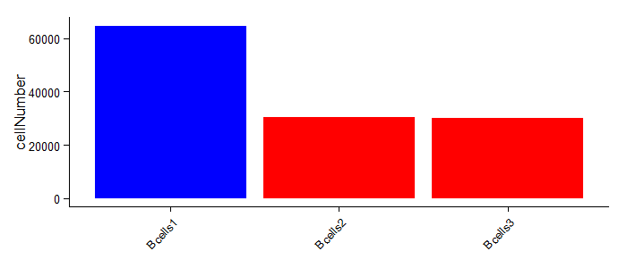
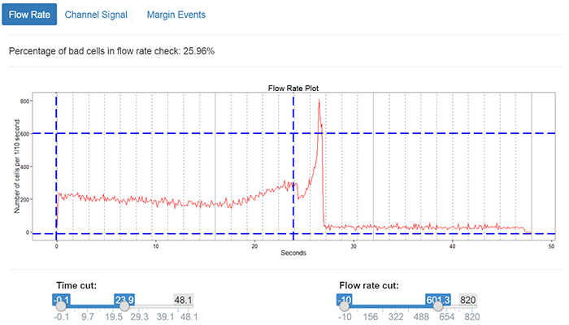
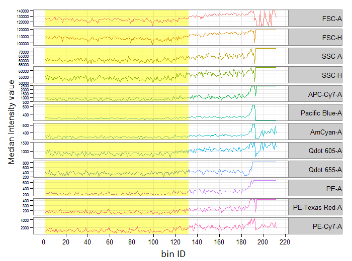
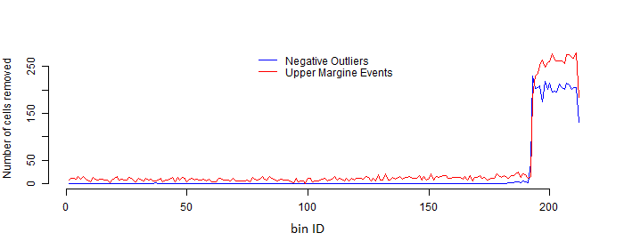

```{r setup, include=FALSE}
knitr::opts_chunk$set(dpi = 300)
knitr::opts_chunk$set(cache=FALSE)
```
## Introduction to flowAI

The flowAI package allows to perform quality control on flow cytometry data in order to warrant superior results for both manual and automated downstream analysis. The package is built on the functions: 1)  `flow_auto_qc`, for the automatic analysis and 2) `flow_iQC()`, for the interactive analysis. The principle behind these two approaches is complementary and takes into account three different properties, i.e. 1) flow rate, 2) signal acquisition and 3) dynamic range.
The evaluation of these properties makes it possible to remove the technical variability derived from surges of the flow rate, laser overheating, data range limitations and other technical issues. 


#### Load the package
After the installation of the package in your local system you can load the package.  

```{r, message=FALSE}
require(flowAI)
```

## Calling functions and loading data

#### Data

For this documentation or for other testing purposes we use a small 
built-in dataset. The dataset was manually created extracting a subsample 
of cells and a subsample of channels from three .fcs files that were part of an
aging study of a Singaporean cohort. 
The dataset was stored as flowSet object and contains three .fcs files imported 
in R as flowFrame objects.

```{r, collapse = TRUE}
data(Bcells)
Bcells
```

To select .fcs files from your working directory you can create a character vector of 
the files you want to analyze calling the function `dir` with "*fcs$" as regular expression
for the pattern argument.

```{r, eval=FALSE}
setwd(...)
fcsfiles <- dir(".", pattern="*fcs$")
```

#### Automatic method
The automatic method is implemented in the function `flow_auto_qc`. 
The following calls show how to perform the quality control with default 
options on the .fcs files contained in your folder and in the dataset contained 
in the FlowAI packages.
The flowAI package depends on the flowCore package to handle .fcs files in the R environment. The flowCore package provides two main classes, `flowFrame` and `flowSet`. The `Bcells` object is an instance of the `flowSet` class and it contain a set of three .fcs files that taken singuarly are instances of the `flowFrame` object.  The `flow_auto_qc` function can be called on either one of the flowCore objects, `flowSet` and `flowFrame`, and on a character vector of the fcs files:

```{r, eval=FALSE}
flow_auto_qc(Bcells)
flow_auto_qc(Bcells[[1]])
flow_auto_qc(fcsfiles)
```

When a character vector is used to call the `flow_auto_qc` function, a `flowSet` object is automatically generated, since the creation of the histogram for the cell number comparison depends on it. 
Therefore, to avoid memory saturation, we suggest to split large datasets in batches that are compatible with the hardware specifications of your computer system.
For example if you wanted batches of maximum 2 gigabytes:
```{r, eval=FALSE}
GbLimit <- 2    # decide the limit in gigabyte your batch of .fcs has to have
size_fcs<-file.size(fcsfiles)/1024/1024/1024    # it calculates the size in gigabytes for each .fcs file
groups <- ceiling(sum(size_fcs)/GbLimit)
cums <- cumsum(size_fcs)
batches <- cut(cums, groups) 
```

Then you can run your analysis on the batches using a for loop:
```{r, eval=FALSE}
for(i in 1:groups){
    flow_auto_qc(fcsfiles[which(batches == levels(batches)[i])]) 
}
```

#### Interactive method
The interactive method is implemented as a Shiny app and is executed through 
the `flow_iQC()` command on the R environment. 
For perfomance and clearness reasons, it allows to analyze one file at a time.
Once you open the Shiny app on your web browser, you can upload the .fcs file from the top part of the left hand side panel. 


## Quality control
The full pipeline of our quality control procedure includes the removal of events having
anomalous values because of:  
1. surges in the flow rate,  
2. signal instability  
2. limitations of the dynamic range 

However, it is possible to perform partial quality control on only one or two of the above mentioned properties of flow cytometry data. For the automatic method, this can be set with the argument `remove_from`.

## Result evaluation
The function `flow_auto_qc` generates a report for each .fcs file to evaluate, in both a graphic and tabular format, the performance of the algorithms in the detection of the anomalies.  
We suggest to run the automatic method first with default settings. If the results are not satisfying you can either modify the settings of the automatic detection methods or use the interacive method `flow_iQC`.


## Case study: B cells from elderly individuals

Here we give an example of the results obtained after performing the quality control on the first .fcs file of the Bcells dataset.

#### File Description
The summary information of the .fcs file analyzed are reported in the first section of the automatically generated report or on the left hand side panel of the `flow_iQC` Shiny app. The summary information contains the name of the file, the number of cells and the total percentage of anomalies detected.

The following information were obtained from the automatically generated report:

> Input File Name: Bcells1    
> Number of Cells: 64562  
> The anomalies were removed from: Flow Rate, Flow Signal and Flow Margin
> Anomalies Detected in total: 40%

#### Cell number comparison among .fcs files of the dataset
If the dataset has more than three .fcs files, the automatic method will report a histogram containing the number of cells for each file. The bar of the .fcs file considered for the remaining part of the report is highlighted in blue.




#### Flow rate check
The flow rate is reconstructed from the .fcs file counting the number of cells analyzed per 1/10 of a second. `flow_auto_qc` uses an anomaly detection algorithm to automatically detect and remove the data acquired during flow rate surges and instabilities. The algorithm is based on the ESD outlier detection method which is optimized to work on seasonality data (https://github.com/twitter/AnomalyDetection).
The anomalies automatically detected are circled in green. 


`flow_iQC` allows to manually select the most stable region of the flow rate.



#### Signal acquisition check
The median value of the signal of equally-sized bins of cells as a function of time is reported for each channel. The mean and standard deviation of the median should remain constant over time. `flow_auto_qc` uses a change point detection method to verify the stability of the signal. Precisely, a shift in the median or the variance is detected by the Binary Segmentation algorithm of the `changepoint` package. In the resulting plot, the region that passed the quality control is highlighted in yellow.



As for the flow rate checking, `flow_iQC` allows to manually choose the most stable region.

#### Dynamic range check
Events from the upper and lower limits of the dynamic range are checked in the last step. For the upper limit, the maximum value of the dynamic range is removed since the instrument is unable to record values exceeding a maximum pre-set by the manufacturer. For the lower limit, the quality control removes all the values below zero for the scatter channels and all the outliers in the negative range for the immunofluorescence channels. The plot shows the frequency of events removed over time; the scaling of the x-axis is complementary to the one of the signal acquisition check.
For this step, both `flow_auto_qc` and `flow_iQC` use the same detection principle to scout for anomalies.




